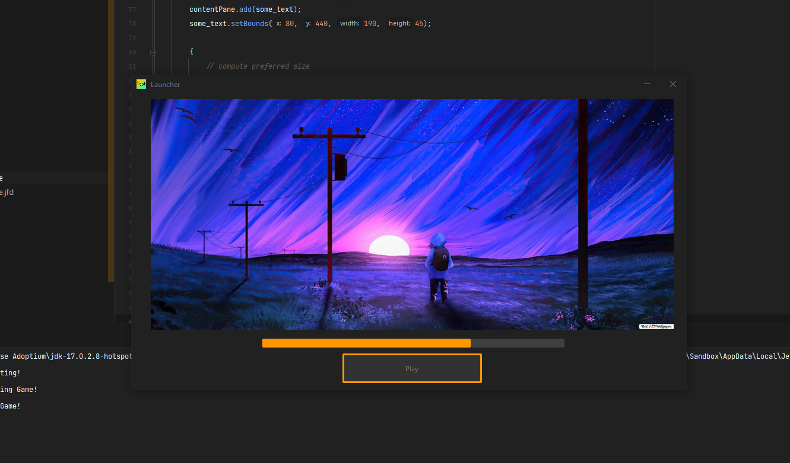

# Custom Minecraft Launcher
It's a Custom Minecraft Launcher made using [Java17](https://www.oracle.com/java/technologies/downloads/#java17) and [JFrame](https://docs.oracle.com/en/java/javase/17/docs/api/java.desktop/javax/swing/JFrame.html).
 
It also uses [FlatLaf](https://github.com/TerrificTable/Custom-Minecraft-Launcher#flatlaf) for the `Material Darker` JFrame theme.
 

 

## FlatLaf: 
- Website: https://www.formdev.com/flatlaf/
- Github: https://github.com/JFormDesigner/FlatLaf/
